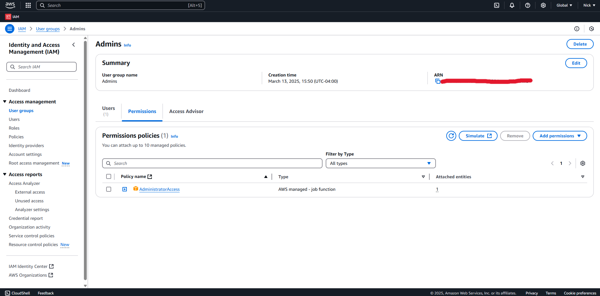
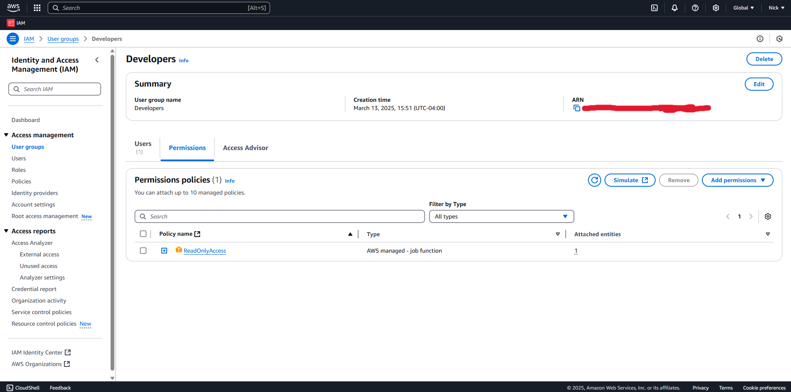

# AWS IAM Project: Access Control and Authentication

This project demonstrates how to use AWS IAM to manage users, groups, and permissions securely. I created two users and two groups to enforce the principle of least privilege and added MFA for extra security.

---

## 1. IAM Dashboard Overview
  
*This screenshot shows the AWS IAM dashboard, where I manage access to AWS resources. It provides an overview of the current IAM setup, including the number of users, groups, and policies. For this project, I focused on creating and managing users and groups to enforce the principle of least privilege.*

---

## 2. User Creation
  
*I created two users: 'AdminUser' and 'RegularUser.' Each user has unique credentials and is assigned to different groups based on their roles. This separation ensures that permissions are tailored to the specific needs of each user, reducing the risk of unauthorized access.*

---

## 3. Group Creation and User Assignment
  
*I set up two groups: 'Admins' and 'Developers.' The 'Admins' group includes 'AdminUser,' who needs full access to manage resources, while the 'Developers' group includes 'RegularUser,' who only requires read-only access. Grouping users simplifies permission management and ensures consistency across similar roles.*

---

## 4. Permission Assignment
  
 
*I assigned the 'AdministratorAccess' policy to the 'Admins' group, granting full access to AWS services. For the 'Developers' group, I attached the 'ReadOnlyAccess' policy, allowing users to view resources without making changes. This setup enforces the principle of least privilege by limiting access based on job requirements.*

---

## 5. MFA Configuration
  
*To enhance security, I enabled Multi-Factor Authentication (MFA) for 'AdminUser.' MFA adds an extra layer of protection by requiring a second form of authentication, such as a code from a mobile app, in addition to the password. This is especially important for users with administrative privileges.*

---

## 6. Testing Permissions
  
*I tested the permissions by logging in as 'AdminUser.' As shown in this screenshot, I successfully created an S3 bucket named 'test-bucket-admin-2025,' demonstrating that the 'AdministratorAccess' policy grants full access to AWS services.*

  
  
*When logged in as 'RegularUser,' I attempted to create an S3 bucket but received an 'Access Denied' error, as shown here. This confirms that the 'ReadOnlyAccess' policy correctly restricts this user to viewing resources without the ability to modify or create them.*

---

## 7. Clean-Up Process
  
*After completing the project, I cleaned up by deleting the users and groups to avoid any potential security risks or unnecessary costs. This step is crucial in maintaining a secure and cost-effective cloud environment.*

---

## What I Learned
- How to manage AWS IAM users and groups effectively.
- The importance of least privilege and MFA in cloud security.
- How to test permissions to ensure they work as intended.
